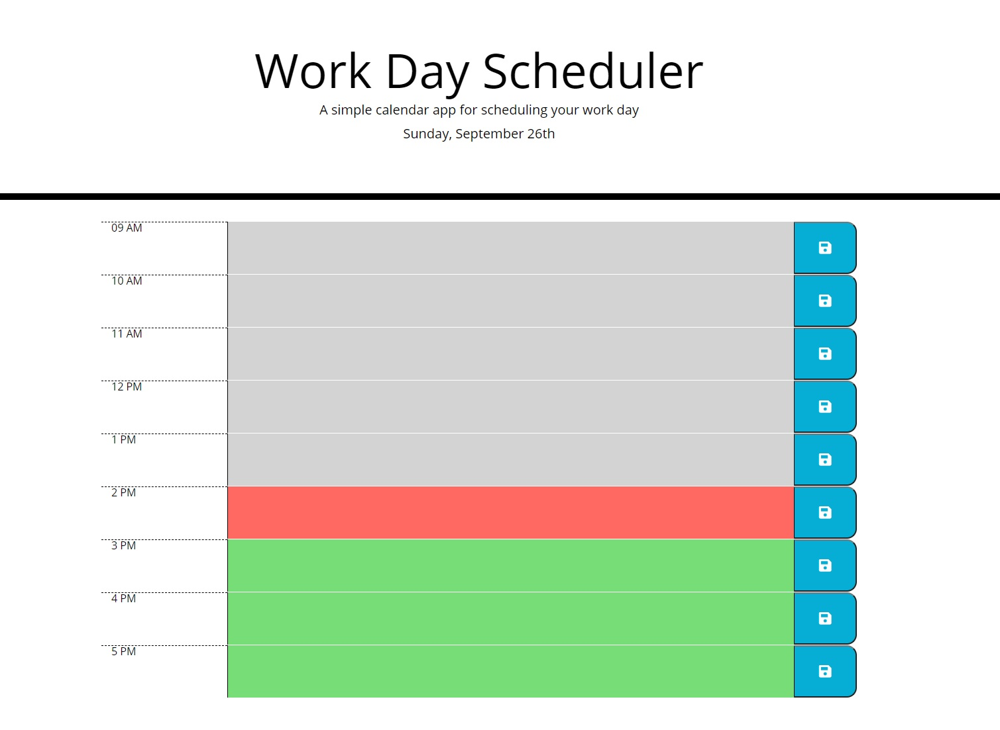

# Work-Day-Scheduler ( Module #5 Challenge )

## Functionality :

Calender application that allows a user to save events for each hour of the day.

## Made with :

- HTML
- CSS
- JavaScript
- Moment.js

## ScreenShot

## Live Link

https://justkidding22.github.io/Work-Day-Scheduler/
